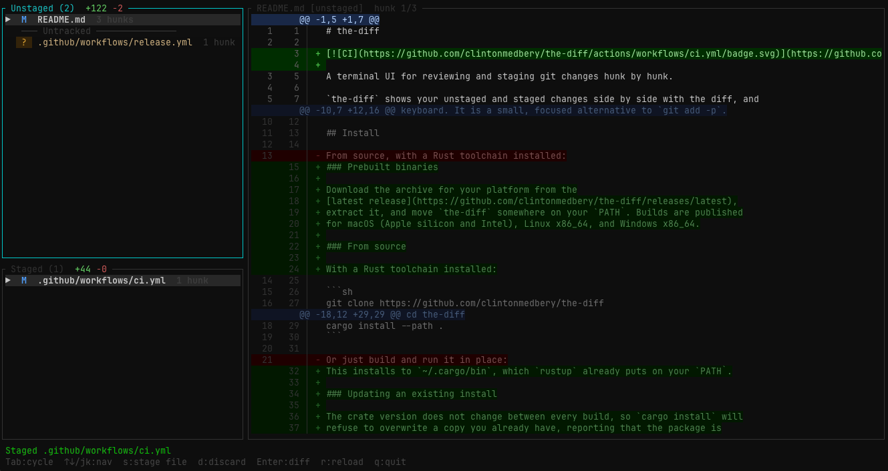

# the-diff

[](https://github.com/clintonmedbery/the-diff/actions/workflows/ci.yml)

A terminal UI for reviewing and staging git changes hunk by hunk.

`the-diff` shows your unstaged and staged changes side by side with the diff, and
lets you stage, unstage, or discard individual hunks without leaving the
keyboard. It is a small, focused alternative to `git add -p`.



*the-diff reviewing its own repository — unstaged files top left, staged bottom
left, and the selected file's hunks on the right.*

## Install

### Prebuilt binaries

Download the archive for your platform from the
[latest release](https://github.com/clintonmedbery/the-diff/releases/latest),
extract it, and move `the-diff` somewhere on your `PATH`. Builds are published
for macOS (Apple silicon and Intel), Linux x86_64, and Windows x86_64.

### From source

With a Rust toolchain installed:

```sh
git clone https://github.com/clintonmedbery/the-diff
cd the-diff
cargo install --path .
```

This installs to `~/.cargo/bin`, which `rustup` already puts on your `PATH`.

### Updating an existing install

The crate version does not change between every build, so `cargo install` will
refuse to overwrite a copy you already have, reporting that the package is
already installed. Pass `--force` to replace it:

```sh
git pull
cargo install --path . --force
```

### Running without installing

```sh
cargo run --release
```

Be aware that this reviews **the-diff's own** working tree, because the binary
looks for a git repository starting from its working directory. To review a
different repository, install the binary and run `the-diff` from inside it.

## Usage

Run `the-diff` from anywhere inside a git repository:

```sh
the-diff
```

It walks up from the current directory to find the repository root, so it works
from subdirectories. If you are not inside a git repo it exits with an error.

The screen is split into three panels:

- **Unstaged** (top left) — modified tracked files, plus untracked files below a
  separator
- **Staged** (bottom left) — what is currently in the index
- **Diff** (right) — the hunks of the selected file, with line numbers

## Keybindings

### Navigation

| Key | Action |
| --- | --- |
| `Tab` | Cycle focus: Unstaged → Staged → Diff |
| `Enter` | Go one level deeper: file list → hunks → lines |
| `Esc` | Come back one level: lines → hunks → file list |
| `↑` / `k` | Move up in a file list, scroll the diff, or move the line cursor |
| `↓` / `j` | Move down in a file list, scroll the diff, or move the line cursor |
| `[` / `]` | Jump to the previous / next hunk |
| `PageUp` / `PageDown` | Scroll the diff by half a screen |
| Mouse wheel | Scroll the diff from anywhere in the window |
| `r` | Reload the diff |
| `q` / `Q` / `Ctrl-C` | Quit |

### Staging

Lowercase acts on the selected hunk when the diff panel is focused, and on the
selected file when a file list is focused. Uppercase always acts on the whole
file.

| Key | Action | Available in |
| --- | --- | --- |
| `s` | Stage hunk or file | Unstaged |
| `S` | Stage whole file | Unstaged |
| `u` | Unstage hunk or file | Staged |
| `U` | Unstage whole file | Staged |
| `d` | Discard hunk or file | Unstaged |
| `D` | Discard whole file | Unstaged |

Discarding is irreversible, so `d` and `D` open a confirmation dialog. Press `y`
to go through with it; any other key cancels. For an untracked file, "discard"
deletes the file from disk.

### Line mode

Press `Enter` again with the diff panel focused to work one line at a time. A
`▌` cursor marks the current line, the panel title shows `line n/m`, and `↑` /
`↓` walk through the diff, rolling into the next hunk at each boundary.

| Key | Action | Available in |
| --- | --- | --- |
| `d` | Discard the line under the cursor | Unstaged |
| `u` | Unstage the line under the cursor | Staged |
| `e` | Open the line in `$VISUAL` / `$EDITOR` | Both |
| `Esc` | Back to hunk mode | Both |

`e` suspends the TUI, runs your editor at that line, and reloads when it exits.
The line-jump argument is chosen from the editor's name — `+n` for the vi
family, nano, and emacs; `-g file:n` for VS Code; `file:n` for Helix, Sublime,
and Zed; `--line n` for the JetBrains editors. An editor it does not recognise
just gets the path, so it opens at the top rather than at a bogus line.

Staging a single line is not supported: `s` needs a patch built against the
index rather than the working tree, which is the opposite of what discarding and
unstaging need. Pressing `s` in line mode says so instead of quietly staging the
whole hunk.

The diff auto-reloads after 10 seconds of inactivity, so changes you make in
your editor show up without pressing `r`.

## How it works

`the-diff` shells out to `git` rather than linking a git library. It reads state
with `git diff`, `git diff --cached`, and `git ls-files --others`, and it makes
changes by piping single-hunk patches to `git apply` (with `--cached` to stage
and `--reverse` to unstage or discard). Whole-file operations use `git add`,
`git reset HEAD`, and `git checkout HEAD`.

Single-line patches are built the same way, with one wrinkle: the patch has to
describe the target as it already stands, so the other changes in the hunk are
rewritten. A sibling addition is already present and becomes a context line; a
sibling deletion is absent and is left out entirely. Reverse-applying the result
undoes the one line and nothing else.

This means it has no opinion about your git config, hooks, or version, and
anything it does is a normal git operation you could have typed yourself.

## License

Dual-licensed under either of:

- Apache License, Version 2.0 ([LICENSE-APACHE](LICENSE-APACHE))
- MIT license ([LICENSE-MIT](LICENSE-MIT))

at your option.

Unless you explicitly state otherwise, any contribution intentionally submitted
for inclusion in this work by you shall be dual-licensed as above, without any
additional terms or conditions.
